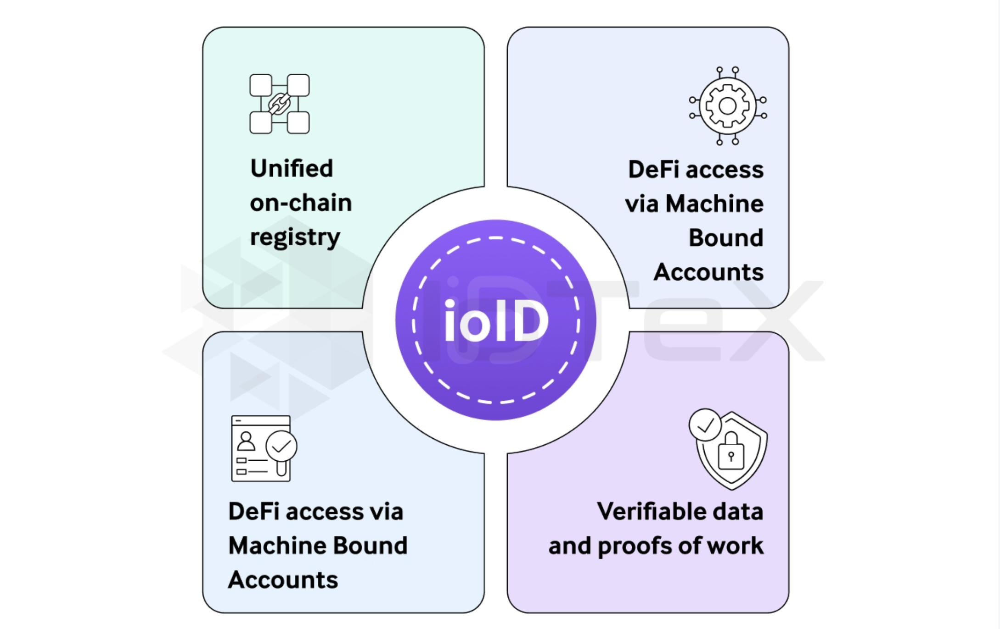

# Technical Specification

## ioID Identifier

The ioID identifier is a DID structured as `did:io:identifier_string`. The `identifier_string` is derived from a unique `project_name` and `project_specific_device_identifier`(e.g., serial number, IMEI, MAC address, etc.).

<figure><figcaption></figcaption></figure>

**ioID identifier Example**: did:io:5RJ1UfUCLX68KeFMmuvaVsm6m5Y7yH1bkF5CC4WpHXxa

## DID Doc

The DID Document is a JSON-LD metadata structure associated with each ioID identifier. Stored securely on IPFS, it contains essential details such as public keys, authentication methods, device location, manufacturer details, and ownership information.

### DID Doc Example (without public key)

```json
{
  "@context": [
    "https://www.w3.org/ns/did/v1",
    "https://w3id.org/security/suites/ed25519-2020/v1" // Assuming a context for owner's potential signature or controller key
  ],
  "id": "did:io:abcdef1234567890geodnet-serial-kitchen-temp-sensor", // Example did:io identifier
  "controller": "did:ethr:0xOwnerWalletAddress", // Example: Controlled by the owner's Ethereum wallet DID
                                                // Alternatively, this could be the project's DID.
  "service": [
    {
      "id": "did:io:abcdef1234567890geodnet-serial-kitchen-temp-sensor#depin-project",
      "type": "DePINProjectMembership",
      "serviceEndpoint": "https://depinscan.io/projects/geodnet",
      "projectName": "GEODNET", //
      "deviceIdentity": "serial-kitchen-temp-sensor" //
    },
    {
      "id": "did:io:abcdef1234567890geodnet-serial-kitchen-temp-sensor#owner",
      "type": "DeviceOwner",
      "serviceEndpoint": "https://depinscan.io/owner/0xOwnerWalletAddress" // Link to owner information if available publicly
    }
  ],
  "assertionMethod": [ // The owner/controller would make assertions on behalf of this DID
    "did:ethr:0xOwnerWalletAddress#key-1"
  ],
  "authentication": [ // The owner/controller authenticates on behalf of this DID
    "did:ethr:0xOwnerWalletAddress#key-1"
  ]
}
```

### DID Doc Example (with public key)

```json
{
  "@context": [
    "https://www.w3.org/ns/did/v1",
    "https://w3id.org/security/suites/ed25519-2020/v1" // Example context for Ed25519 keys
  ],
  "id": "did:io:5RJ1UfUCLX68KeFMmuvaVsm6m5Y7yH1bkF5CC4WpHXxa", // Using example from PRD [cite: 47]
  "verificationMethod": [
    {
      "id": "did:io:5RJ1UfUCLX68KeFMmuvaVsm6m5Y7yH1bkF5CC4WpHXxa#keys-1",
      "type": "Ed25519VerificationKey2020", // Type updated to a more current one if applicable
      "controller": "did:io:5RJ1UfUCLX68KeFMmuvaVsm6m5Y7yH1bkF5CC4WpHXxa", // Device controls its own key
      "publicKeyMultibase": "zH3C2AVvLMfThF3xGk8qEsvTZbW2nK7QULaFVpJ6zC1db" // publicKeyBase58 from PRD [cite: 60] example, converted to multibase format
    }
  ],
  "authentication": [
    "did:io:5RJ1UfUCLX68KeFMmuvaVsm6m5Y7yH1bkF5CC4WpHXxa#keys-1"
  ],
  "assertionMethod": [
    "did:io:5RJ1UfUCLX68KeFMmuvaVsm6m5Y7yH1bkF5CC4WpHXxa#keys-1"
  ],
  "capabilityInvocation": [ // Example: for invoking capabilities like signing transactions for its MBA
    "did:io:5RJ1UfUCLX68KeFMmuvaVsm6m5Y7yH1bkF5CC4WpHXxa#keys-1"
  ],
  "capabilityDelegation": [ // Example: for delegating capabilities
    "did:io:5RJ1UfUCLX68KeFMmuvaVsm6m5Y7yH1bkF5CC4WpHXxa#keys-1"
  ],
  "service": [
    {
      "id": "did:io:5RJ1UfUCLX68KeFMmuvaVsm6m5Y7yH1bkF5CC4WpHXxa#mba",
      "type": "MachineBoundAccount",
      "serviceEndpoint": "erc6551:1/0xNFTContractAddress/TokenID_Corresponding_To_ioID" // Example URI to locate MBA info
    },
    {
      "id": "did:io:5RJ1UfUCLX68KeFMmuvaVsm6m5Y7yH1bkF5CC4WpHXxa#depin-data",
      "type": "DePINDataService",
      "serviceEndpoint": "https://api.project.example/device/5RJ1UfUCLX68KeFMmuvaVsm6m5Y7yH1bkF5CC4WpHXxa/data"
    }
  ]
}
```

## Device NFT

Device NFTs are ERC-721 tokens that represent physical assets on-chain, correlating directly with physical device ownership. Each NFT contains a unique 32-byte token ID linking directly to its corresponding ioID.

**tokenID Example**: `0x00000000000000000000000000000001(32 bytes) <-> 1(uint256`)

## ioID Registry

The ioID registry is a smart contact deployed on IoTeX L1, storing all mapping information between devices, owners NFTs and MBAs. This is the essence of ERC-6551 which we borrowed. See the example below.

| ioID Identifier                              | NFT chainID | NFT contract address | NFT tokenID |
| -------------------------------------------- | ----------- | -------------------- | ----------- |
| 5RJ1UfUCLX68KeFMmuvaVsm6m5Y7yH1bkF5CC4WpHXxa | 1           | 0xabc                | #123        |

The _**owner's wallet address**_ of the device can be accessed by calling `ownerOf(uint256 tokenId)` in the NFT contract and the _**MBA account address**_ of the device can be accessed by calling `function account(address implementation, bytes32 salt, uint256 chainId, address tokenContract, uint256 tokenId)` in the MBA factory contract.

## Machine-Bound Account (MBA)

MBAs are ERC-6551-inspired smart contract wallets bound to device NFTs, enabling secure interactions with various Dapps. They facilitate activities such as reward distributions, staking, lending, and more.

### MBA Generation

The generation of an MBA follows ERC-6551 specification, where the tokenID could be provided by a DePIN project. Here are some examples of MBA addresses:

* EVM: 0xb2119aF10cc641162968ED255dC4E688dC4B2B6E
* Solana: FDNY674k4dC9zoGSnGzaajjYnXoKKvAAp3GZU7sAfnGX

### Implemenation

**Factory**

The reference implementation of an MBA factory contract is available at https://eips.ethereum.org/EIPS/eip-6551#registry.

**Account Interface**

The MBA implementation should follow the rules as described below:

* All token bound accounts SHOULD be created via the singleton registry;
* All token bound account implementations MUST implement ERC-165 interface detection;
* All token bound account implementations MUST implement ERC-1271 signature validation.
* All token bound account implementations MUST implement the following interface.

```solidity
/// @dev the ERC-165 identifier for this interface is `0x6faff5f1`
interface IERC6551Account {
     /**
      * @dev Allows the account to receive Ether.
      *
      * Accounts MUST implement a `receive` function.
      *
      * Accounts MAY perform arbitrary logic to restrict conditions
      * under which Ether can be received.
      */
     receive() external payable;
     /**
      * @dev Returns the identifier of the non-fungible token which owns the account.
      *
      * The return value of this function MUST be constant - it MUST NOT change over time.
      *
      * @return chainId       The chain ID of the chain the token exists on
      * @return tokenContract The contract address of the token
      * @return tokenId       The ID of the token
      */
     function token() external view returns (uint256 chainId, address tokenContract, uint256 tokenId);
     /**
      * @dev Returns a value that SHOULD be modified each time the account changes state.
      *
      * @return The current account state
      */
     function state() external view returns (uint256);
     /**
      * @dev Returns a magic value indicating whether a given signer is authorized to act on behalf
      * of the account.
      *
      * MUST return the bytes4 magic value 0x523e3260 if the given signer is valid.
      *
      * By default, the holder of the non-fungible token the account is bound to MUST be considered
      * a valid signer.
      *
      * Accounts MAY implement additional authorization logic which invalidates the holder as a
      * signer or grants signing permissions to other non-holder accounts.
      *
      * @param  signer     The address to check signing authorization for
      * @param  context    Additional data used to determine whether the signer is valid
      * @return magicValue Magic value indicating whether the signer is valid
      */
     function isValidSigner(address signer, bytes calldata context)
         external
         view
         returns (bytes4 magicValue);
}
```

**Universal Transaction Execution Interface**

All token bound accounts MUST implement an execution interface which allows valid signers to execute arbitrary operations on behalf of the account. Support for an execution interface MUST be signaled by the account using ERC-165 interface detection. `isValidExecutor` enables outsourcing specific contract interactions, such as automated staking, to a trusted contract on behalf of the account.

```solidity
/// @dev the ERC-165 identifier for this interface is `0x51945447`
interface IERC6551Executable {
     /**
      * @dev Executes a low-level operation if the caller is a valid signer on the account.
      *
      * Reverts and bubbles up error if operation fails.
      *
      * Accounts implementing this interface MUST accept the following operation parameter values:
      * - 0 = CALL
      * - 1 = DELEGATECALL
      * - 2 = CREATE
      * - 3 = CREATE2
      *
      * Accounts implementing this interface MAY support additional operations or restrict a signer's
      * ability to execute certain operations.
      *
      * @param to        The target address of the operation
      * @param value     The Ether value to be sent to the target
      * @param data      The encoded operation calldata
      * @param operation A value indicating the type of operation to perform
      * @return The result of the operation
      */
     function execute(address to, uint256 value, bytes calldata data, uint8 operation)
         external
         payable
         returns (bytes memory);
      
     /**
      * @notice Returns whether a given account is authorized to execute transactions on behalf of
      * this account
      *
      * @param executor The address to query authorization for
      * @param to        The target address of the operation
      * @param data      The encoded operation calldata
      * @return True if the executor is authorized, false otherwise
      */
     function _isValidExecutor(address executor, address to, bytes calldata data) 
        internal 
        view 
        virtual 
        override 
        returns (bool); 
}
```

**Account Execution Delegation**

The `ExecutionDelegation` interface provides a standardized mechanism for token bound accounts to manage permissions for delegators to execute specific functions on behalf of the account (aka whitelist). Each account includes a boolean flag that can be set by the account owner to enable or disable the delegation feature. When the delegation feature is enabled, the account’s delegation permissions are managed by a trusted `Account Execution Delegation` contract, which controls the authorized functions globally for accounts, offering a standardized approach to permission management. This interface enables the account (or the trusted contract, when delegation is enabled) to authorize and revoke permissions for delegators to call particular functions, identified by their 4-byte signatures, enhancing the flexibility and security of account interactions.

```solidity
interface ExecutionDelegation {
     /**
     * @dev Authorizes the specified delegator to execute the function identified by the given 4-byte signature on the specified contract (`to`) on behalf of the account.
     * @param delegator The address of the entity being granted permission.
     * @param to The address of the contract that the delegator is allowed to interact with.
     * @param functionSignature The 4-byte signature of the function that the delegator is allowed to execute on the `to` contract.
     * @notice This function should only be called by authorized entities, such as the account owner or an authorized executor.
     */
    function authorizeDelegator(address delegator, address to, bytes4 functionSignature) external;
    /**
     * @dev Revokes the permission previously granted to the specified delegator for the function identified by the given 4-byte signature on the specified contract (`to`).
     * @param delegator The address of the entity whose permission is being revoked.
     * @param to The address of the contract for which the permission is being revoked.
     * @param functionSignature The 4-byte signature of the function for which permission is being revoked.
     * @notice This function should only be called by authorized entities, such as the account owner or an authorized executor.
     */
    function revokeDelegator(address delegator, address to, bytes4 functionSignature) external;
    /**
     * @dev Returns an array of 4-byte function signatures that the specified delegator is authorized to execute on the specified contract (`to`) on behalf of the account.
     * @param delegator The address of the entity to check authorizations for.
     * @param to The address of the contract to check authorizations against.
     * @param functionSignature The 4-byte signature of the function for which permission is being revoked.
     * @return a bool for whether to execute on the `to` contract.
     * @notice This function does not modify state and can be called by anyone to check the permissions of a delegator for a specific contract.
     */
    function isAuthorized(address delegator, address to, bytes4 functionSignature) external view returns (bool);
}
```

### Integration of MBA with Third-Party Services

The figure below demonstrates a typical workflow of how on‐chain rewards from a third‐party “Rewards Dapp” can be automatically re‑staked into a separate “Staking Dapp” via an off‑chain “Auto‑staking Service” and an MBA wallet module.&#x20;

<figure><figcaption></figcaption></figure>

The auto-staking process consists of the following five steps:

**Step 1: Rewards Distribution → MBA** The third‑party Rewards Dapp issues a token transfer to the MBA address (0x1234) by calling `transfer(address recipient, uint256 amount)` on the token contract. Those tokens land in the MBA’s on‑chain account.

**Step 2: Event Monitoring by Off‑chain Indexer** The Auto‑staking Service’s off‑chain indexer watches the blockchain for the `Transfer` event to the user’s MBA address. As soon as it sees a new reward deposit, it triggers the next step.

**Step3: Indexer → Auto‑staking Contract Invocation** The indexer sends an on‑chain transaction invoking the Auto‑staking Service’s smart contract, passing in the recipient address (0x1234) so that the service can act on behalf of that user.

**Step 4: Auto‑staking Contract → MBA DelegateCall** The Auto‑staking Contract uses Solidity’s `call` to execute a payload `{stake(uint256 amount)}` in the context of the MBA. This means the MBA itself is authorizing the staking action, preserving the user’s on‑device key/security assumptions.

**Step 5: MBA → Third‑party Staking Dapp** Finally, the  MBA makes a standard `stake(uint256 amount)` call to the third‑party Staking Dapp’s contract (staking service can be provided by other projects), locking the newly received reward tokens into the staking program.
